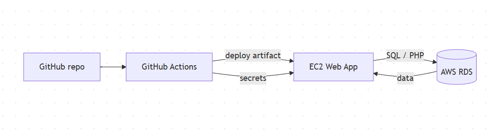
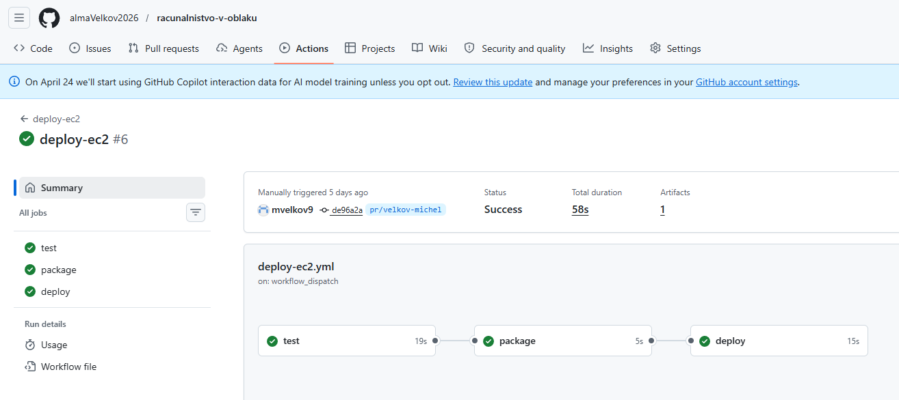
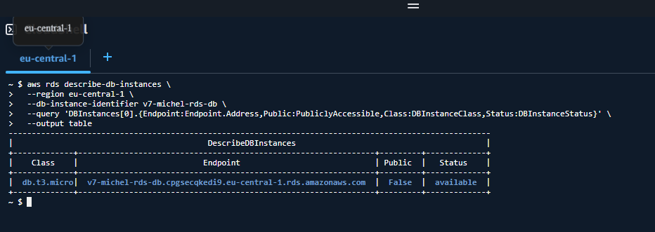
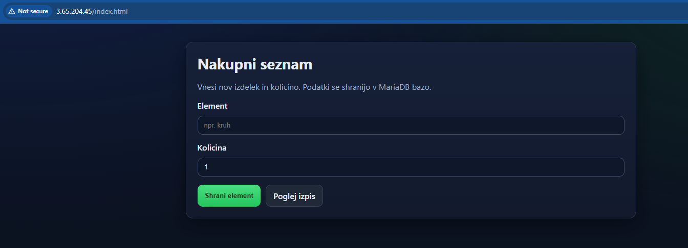
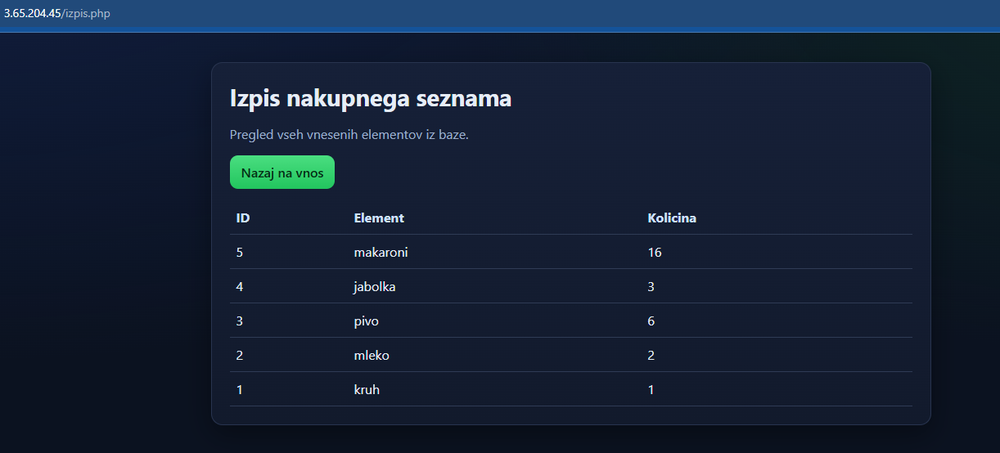
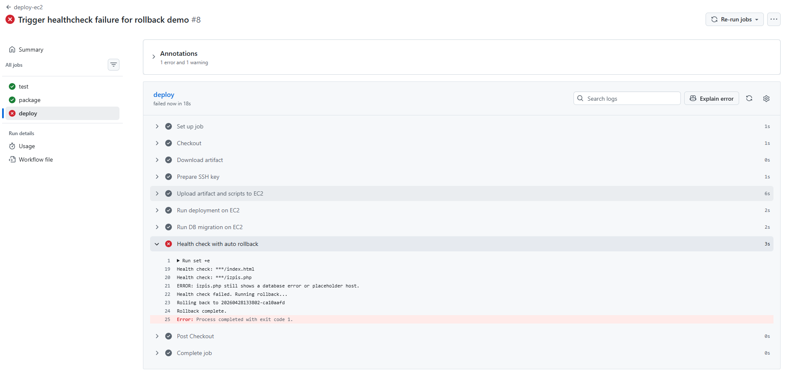
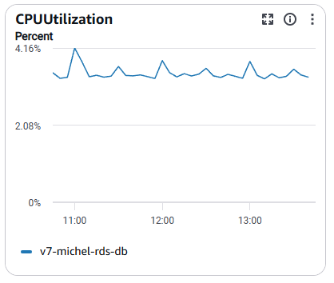
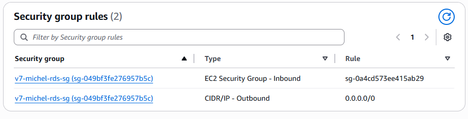

# Praktični projekt: Avtomatski deploy spletne aplikacije na AWS

Avtor: Velkov Michel  
Predmet: Računalništvo v oblaku  
Datum: 28.4.2026

## 1) Opis projekta
Cilj projekta je bil postaviti avtomatski CI/CD proces za spletno aplikacijo na AWS. Rešitev uporablja GitHub Actions za avtomatski deploy, EC2 za poganjanje PHP aplikacije in RDS za podatkovno bazo. Glavna vrednost projekta je v tem, da se nova verzija kode ob pushu samodejno preveri, namesti, poveže z bazo, preveri z health checkom in po potrebi vrne na prejšnjo stabilno različico.

## 2) Cilji
- zmanjšati ročno delo pri izdaji nove verzije,
- zagotoviti ponovljiv deploy,
- ločiti aplikacijski strežnik in bazo,
- uporabiti managed bazo (RDS) namesto self-managed baze na EC2,
- dodati rollback mehanizem za napake pri deployu.

## 3) Izvedba
Najprej sem pripravil infrastrukturo za bazo na AWS RDS in preveril dostop med EC2 in RDS prek security groups. Nato sem pripravil GitHub Actions workflow, ki ob pushu ali ročnem zagonu izvede naslednje korake: test PHP datotek, priprava release arhiva, prenos na EC2, deploy na strežnik, migracija baze, health check in rollback ob napaki.

### 3.1) Arhitektura in infrastruktura
Arhitektura je sestavljena iz GitHub repozitorija, GitHub Actions pipeline-a, EC2 instance z Apache/PHP in RDS MySQL baze. RDS ostane nedostopen iz interneta, do baze pa lahko dostopa samo EC2 prek pravilnih security group pravil. Takšna ločitev zmanjša tveganje in je bližje produkcijski praksi.

### 3.2) CI/CD pipeline
Workflow ima tri osnovne faze: test, package, deploy. V fazi test se izvede PHP lint, v package se pripravi artifact, v deploy pa se artifact prenese na EC2. Na EC2 se izvede deploy skripta, sledi migracija baze, nato health check. Če health check ne uspe, se sproži rollback na zadnji stabilni release.

### 3.3) Deploy skripte in release proces
Deploy skripte na EC2 ustvarijo novo release mapo, preklopijo simbolno povezavo na trenutno verzijo, sinhronizirajo vsebino v aplikacijski direktorij in ponovno zaženejo Apache. S tem se izognem ročnemu kopiranju datotek ter zagotovim hiter povratek na prejšnjo stabilno verzijo.

### 3.4) Migracije baze
Migracijska skripta poskrbi za strukturo baze: ustvari tabelo nakup in tabelo schema_migrations. V migracijah se spremlja, ali je bil določen release že uporabljen, s čimer je proces ponovljiv in preverljiv.

## 4) Rezultati
Projekt uspešno izvede avtomatski deploy iz GitHub-a na EC2 in poveže aplikacijo z RDS. Health check preveri, ali aplikacija dejansko vrača podatke iz baze, migracija baze pa se izvede v okviru deploy procesa. Ob napaki se izvede rollback, kar potrjuje, da sistem zna samodejno obnoviti stabilno različico.

V praksi to pomeni, da je nova verzija lahko objavljena z enim pushom. Če pride do napake (npr. napačna konfiguracija baze ali zlom strani), pipeline sam sproži povratek in s tem zmanjša izpad.

## 5) Varnost
Pri projektu sem uporabil GitHub Secrets za občutljive podatke, RDS je ostal nedostopen iz interneta, dostop do baze pa je omejen na security group aplikacijskega strežnika. To zmanjša napadalno površino in pokaže pravilnejši pristop k oblačni arhitekturi.

Varnostni vidik je viden tudi v tem, da so gesla in ključi shranjeni izključno v GitHub Secrets, ne v kodi. Na nivoju omrežja so pravila stroga: inbound do baze je dovoljen le iz EC2 security group, outbound pravila so standardna.

## 6) Zaključek
Projekt je pokazal, kako lahko tudi enostavna PHP aplikacija dobi produkcijsko bolj zrel deployment proces. Največja prednost je avtomatizacija, saj deployment ne zahteva ročnega kopiranja datotek, hkrati pa je v proces vključen tudi nadzor nad zdravjem aplikacije in možnost povratka na stabilno verzijo.

Če bi projekt še razširil, bi dodal avtomatsko testiranje funkcionalnosti, več stopenj okolij (dev/stage/prod) ter strožjo politiko dostopa do SSH. To bi še bolj približalo rešitev realnim produkcijskim praksam.

## 7) Zaslonske slike
### 7.1) Arhitektura projekta

### 7.2) GitHub Actions workflow

### 7.3) RDS nastavitve in endpoint

### 7.4) Deploy na EC2

### 7.5) Health check in izpis podatkov iz baze

### 7.6) Rollback scenarij

### 7.7) CloudWatch (opcijsko)

### 7.8) Security group pravila (opcijsko)

## 8) Viri
- Amazon Web Services. (2026). Amazon EC2 User Guide for Linux Instances. https://docs.aws.amazon.com/AWSEC2/latest/UserGuide/
- Amazon Web Services. (2026). Amazon RDS User Guide. https://docs.aws.amazon.com/AmazonRDS/latest/UserGuide/
- GitHub. (2026). GitHub Actions Documentation. https://docs.github.com/actions
- GitHub. (2026). Encrypted secrets in GitHub Actions. https://docs.github.com/actions/security-guides/encrypted-secrets
